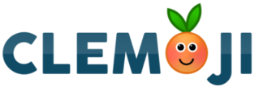

========

Vous trouvez les smileys de ZesteDeSavoir.fr trop communs ? Vous aimeriez voir quelque chose de plus original ? Des smileys créés selon l'avis de la communauté ?

**J'ai une solution pour vous...** Cette solution se nomme... **"Clemoji"**

-------------

## I - Un peu de vocabulaire

- "**Clemoji**" est le nom du pack de smileys
- "**Les Clemojis**" sont tous les smileys
- Donc "**Un Clemoji**" est un des smileys 

*Oui oui... C'est compliqué...* 

## II - Le futur de Clemoji

Tout d'abord, de nouveaux clemojis vont être créés. Je vous invite à proposer des idées sur [Zeste de savoir (topic dédié)](http://zestedesavoir.com/forums/sujet/538/clem-sur-le-devant-de-la-scene/).

Ensuite, il faut que les developpeurs de Zeste de Savoir developpent la fonctionnalité des packs de smileys afin que Clemoji puisse être intégré.

## III - Constatons l'évolution de Clemoji depuis sa création

(le premier smiley provient du *Site du Zero* et a servi de base aux clemojis)

 -  -  -  -  - 

Nous conviendrons que la dernière version est de loin la plus aboutie ! 😙

----------
Bref... Ce ReadMe est terminé... Tu peux maintenant le partager sur Facebook et Twitter et Watcher ce Repo... #ZutOnEstPasSurYoutube...
